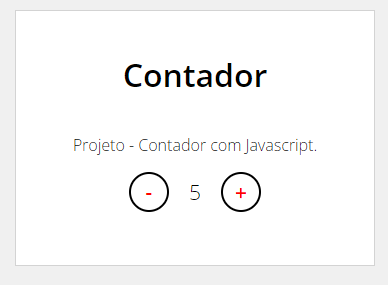
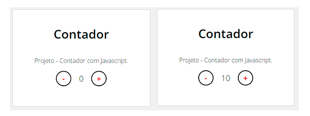
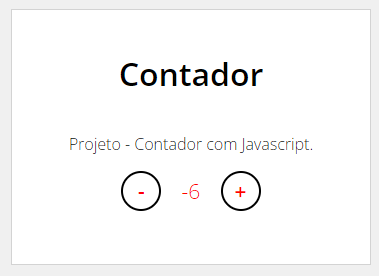

# 💻 | Projeto: Contador - Desafio DIO.

### Projeto feito para por em prática as aulas: **Introdução ao JavaScript**.

Seja bem vindo ao meu projeto chamado contator, feito totalmente para meus estudos e aperfeiçoamento como profissional. ❤️

- Colocando em prática conceitos obtidos durante a aula.

- Utilizando: HTML, CSS e JavaScript.

Ao fim do projeto a tutora Sthephy Nusch deu dois desafios, sendo eles:

- 1: Limitar o contador de 0 a 10.
- 2:  Mudar a cor do número para vermelho quando o mesmo for negativo.

# Para obter o que se pede eu utilizei os códigos javascript a baixo:

## DESAFIO 01: LIMITANDO DE 0 A 10
Aproveitei o código que estudamos na aula para fazer o primeiro desafio.

```js
var currentNumberWrapper = document.getElementById("currentNumber");

var currentNumber = 0;

function increment() {
    if (currentNumber < 10 ) {
    currentNumber = currentNumber + 1;
    currentNumberWrapper.innerHTML = currentNumber;
    }
}

function decrement() {
    if (currentNumber > 0 ) {
    currentNumber = currentNumber - 1;
    currentNumberWrapper.innerHTML = currentNumber;
    }
}
```
## DESAFIO 02: MUDAR DE COR SE CASO O NÚMERO FOR NEGATIVO
O segundo desafio tive que tomar mais atenção e pesquisar sobre, econtrei a solução em sites de fora e pesquisando nos fóruns da própria DIO.

```js
let count = 0;

const CURRENT_NUMBER = document.getElementById('currentNumber');
const TXT = document.getElementById('text');

function increment() {
    if(count  < 10 || count < -10){	
        count++;
        CURRENT_NUMBER.innerHTML = count;
        if(count >= 0){
        CURRENT_NUMBER.style.color = "black";
        }
        CURRENT_NUMBER.addEventListener("increment")
    }
}

function decrement() {
    if(count  <= 10 && count > -10){	
        count--;
        CURRENT_NUMBER.innerHTML = count;
        if(count < 0){
            CURRENT_NUMBER.style.color = "red";
        }
        CURRENT_NUMBER.addEventListener("decrement")
    }
}
```


### 📸 | Screenshots:
- **CONTADOR** <br><br>
<br><br>
- **CONTADOR LIMITANDO DE 0 A 10** <br><br>
<br><br>
- **CONTADOR MUDAR DE COR SE CASO O NÚMERO FOR NEGATIVO** <br><br>

<br><br>

## 👩‍💻 Meus Links:

- Github: [Victor Hugo.](https://github.com/torugo99)
- LinkedIn: [Victor Hugo.](https://www.linkedin.com/in/victor-hugo99/)
- Meu Site: [Victor99dev.](http://victor99dev.site/)

### 😀 | Créditos e Agradecimentos:

- Obrigado a DIO a essa oportunidade de UP na minha carreira! ❤️